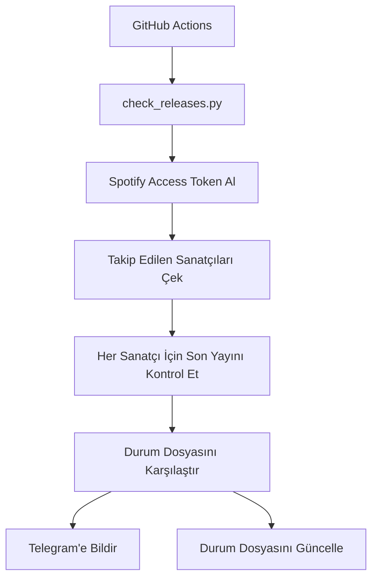

# Spotify Yeni Şarkı Takipçisi

Bu proje, Spotify hesabında takip ettiğiniz sanatçıların yeni albüm/single yayınlarını kontrol eder ve değişiklikleri Telegram üzerinden bildirir.

## Amaç

- Spotify erişim token’ını yenilemek
- Takip edilen sanatçı listesini almak
- Her sanatçının en güncel sürümünü kontrol etmek
- Yeni yayın bulunduğunda Telegram bildirimi göndermek
- Son kontrol durumunu yerel olarak saklamak

## Proje Yapısı

```text
.
├── .github/
│   └── workflows/
│       └── check.yml          # GitHub Actions iş akışı
├── check_releases.py         # Ana takip mantığı
├── get_refresh_token.py      # Spotify refresh token alma yardımcı scripti
├── state.json                # Son bilinen yayın ID'lerini saklar
└── README.md                 # Bu belge
```

## Mimari

Bu proje basit ve tek oturumlu bir mimariye sahiptir:

1. Kimlik doğrulama
   - Spotify API’ye erişim için refresh token kullanılır.
   - Token, ortam değişkenleri üzerinden alınır.

2. Veri toplama
   - Spotify API üzerinden takip edilen sanatçı listesi çekilir.
   - Her sanatçı için en güncel albüm/single bilgisi alınır.

3. Durum yönetimi
   - Önceki yayın ID’leri state.json dosyasında saklanır.
   - Yeni yayın, eski durumla karşılaştırılır.

4. Bildirim
   - Yeni yayın bulunduysa Telegram botu ile mesaj gönderilir.

5. Otomasyon
   - GitHub Actions, her 6 saatte bir scripti çalıştırır.

## Ana Akış



## Algoritmalar ve Mantık

### 1. Access Token Alma Algoritması

Dosya: check_releases.py

Amaç: Spotify API’ye erişmek için geçerli bir access token elde etmek.

Adımlar:
- Spotify token endpoint’ine POST isteği gönderilir.
- refresh_token, client_id ve client_secret gönderilir.
- Yanıttan access_token çıkarılır.

Kullanılan yapılar:
- requests.post()
- os.environ[]

### 2. Takip Edilen Sanatçıları Çekme Algoritması

Amaç: Kullanıcının Spotify hesabında takip ettiği sanatçıların listesini almak.

Adımlar:
- /v1/me/following endpoint’ine istek atılır.
- artists.items içinden sanatçı bilgileri toplanır.
- next değeri varsa bir sonraki sayfaya geçilir.
- Tüm sayfalar dolaşılarak liste genişletilir.

Bu mantık, sayfalama (pagination) yapar.

### 3. En Yeni Yayın Alma Algoritması

Amaç: Bir sanatçının en yeni single/album bilgisini almak.

Adımlar:
- /v1/artists/{artist_id}/albums endpoint’ine istek yapılır.
- include_groups=single,album parametresi kullanılır.
- limit=1 verilir.
- İlk sonuç, en güncel yayın olarak kabul edilir.

### 4. Durum Karşılaştırma Algoritması

Amaç: Daha önce bildirilen yayın ile şu anki yayın arasındaki değişikliği tespit etmek.

Adımlar:
- state.json dosyasından önceki yayın ID’leri yüklenir.
- Her sanatçı için mevcut yayın ID’si alınır.
- Eğer mevcut ID önceki ID ile farklıysa:
  - ilk çalıştırmada bildirim verilmez
  - daha önce durum varsa Telegram mesajı gönderilir
  - yeni ID state’e yazılır

### 5. Telegram Bildirim Algoritması

Amaç: Yeni yayın bulunduğunda kullanıcıya mesaj göndermek.

Adımlar:
- Telegram bot API endpoint’ine POST gönderilir.
- chat_id ve text parametreleri ile mesaj iletilir.

## Dosya Bazında Açıklama

### check_releases.py

Ana script’tir. Aşağıdaki görevleri yapar:
- Çevresel değişkenleri okur
- Access token alır
- Takip edilen sanatçıları çeker
- Her sanatçı için son yayın bilgisini kontrol eder
- Durumu state.json dosyasına kaydeder
- Yeni yayın varsa Telegram bildirimi gönderir

### get_refresh_token.py

İlk kurulum sırasında çalıştırılır. Şu işlemleri yapar:
- Kullanıcıyı Spotify yetkilendirme sayfasına yönlendirir
- Redirect URI üzerinden gelen auth code’u yakalar
- Bu kodu kullanarak refresh token elde eder

### state.json

JSON formatında saklanır. Yapısı:

```json
{
  "artist_id": "last_release_id"
}
```

Örnek:

```json
{
  "4inwzuD2iBZK8Ck3ft7Wlk": "05jwTfDpVJmxvaXeBr7SLf"
}
```

## Kullanılan Python Söz Dizimi ve Yapıları

Bu projede kullanılan temel Python yapıları şunlardır:

### 1. Importlar

```python
import requests
import json
import os
```

Amaç: Harici kütüphane ve standart modülleri projeye dahil etmek.

### 2. Değişken Tanımlama

```python
SPOTIFY_CLIENT_ID = os.environ["SPOTIFY_CLIENT_ID"]
```

Amaç: Ortam değişkenlerinden değer okumak.

### 3. Fonksiyon Tanımlama

```python
def get_access_token():
    ...
```

Amaç: Mantığı parçalayarak tekrar kullanılabilir hale getirmek.

### 4. Dictionary ve Liste Kullanımı

```python
artists = []
state = load_state()
```

```python
state[artist_id] = release_id
```

Amaç: Veri depolamak ve anahtar-değer ilişkisi kurmak.

### 5. Döngüler

```python
for artist in artists:
    ...
```

Amaç: Her sanatçı için aynı mantığı tekrar etmek.

### 6. Koşullar

```python
if last_known != release_id:
    ...
```

Amaç: Durum değişikliğini tespit etmek.

### 7. JSON Okuma/Yazma

```python
with open(STATE_FILE) as f:
    return json.load(f)
```

```python
with open(STATE_FILE, "w") as f:
    json.dump(state, f, ensure_ascii=False, indent=2)
```

Amaç: Durumu kalıcı olarak saklamak.

### 8. f-string Biçimlendirme

```python
msg = f"🎵 {artist_name} yeni bir sarki cikardi: {release['name']}\n{release['external_urls']['spotify']}"
```

Amaç: Metin içinde değişkenleri yerleştirmek.

## GitHub Actions İş Akışı

Dosya: .github/workflows/check.yml

Bu iş akışı şunları yapar:
- Her 6 saatte bir çalışır
- Python 3.11 kurar
- requests kütüphanesini yükler
- check_releases.py çalıştırır
- state.json dosyasını commit eder ve push eder

## Kurulum Adımları

### 1. Bağımlılıkları kur

```bash
pip install requests
```

### 2. Ortam değişkenlerini tanımla

Gerekli değişkenler:
- SPOTIFY_CLIENT_ID
- SPOTIFY_CLIENT_SECRET
- SPOTIFY_REFRESH_TOKEN
- TELEGRAM_TOKEN
- TELEGRAM_CHAT_ID

### 3. İlk çalıştırma

```bash
python check_releases.py
```

### 4. İlk refresh token almak için

```bash
python get_refresh_token.py
```

## Güvenlik Notu

- client secret ve token değerlerini asla public repo’ye eklemeyin.
- GitHub Secrets veya benzeri güvenli bir yöntem kullanın.
- state.json dosyası da lokal olarak tutulmalı; isterseniz .gitignore’e eklenebilir.

## Kısa Özet

Bu proje, Spotify API ile çalışan basit ama pratik bir izleme sistemidir. Temel mantığı şu şekildedir:

- Spotify’dan takip edilen sanatçıları al
- Her sanatçı için son yayını kontrol et
- Daha önce bilinenden farklıysa bildir
- Durumu sakla

Bu yapı, küçük ölçekli otomasyon görevleri için oldukça uygun bir örnektir.
